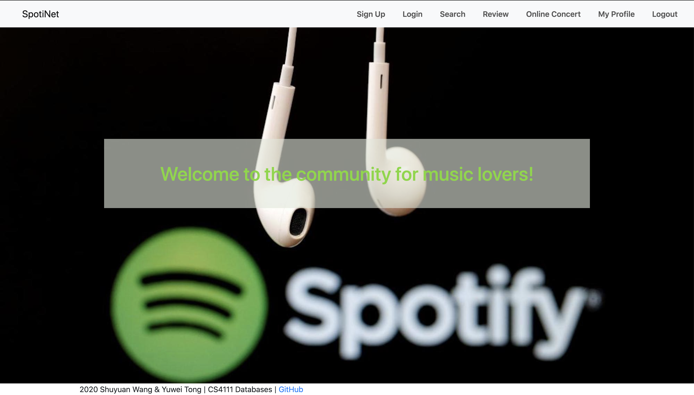
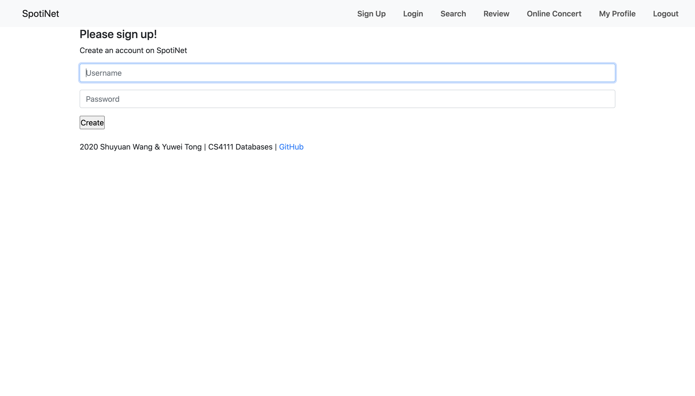
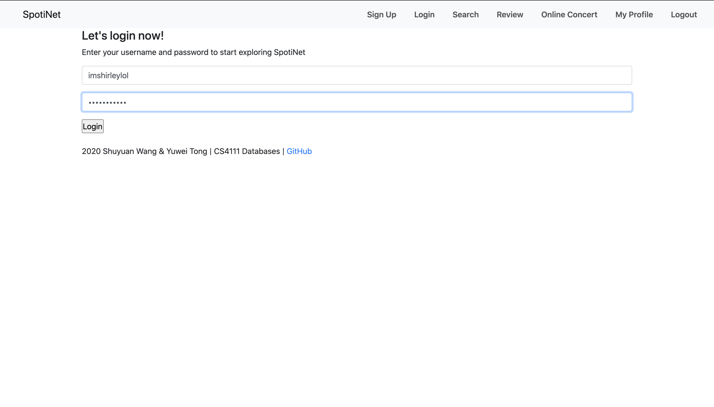
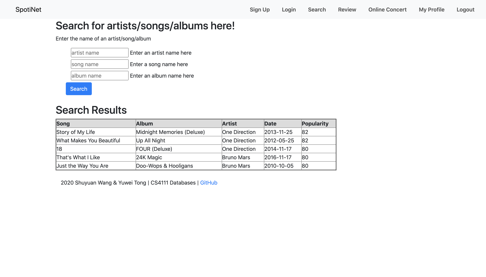
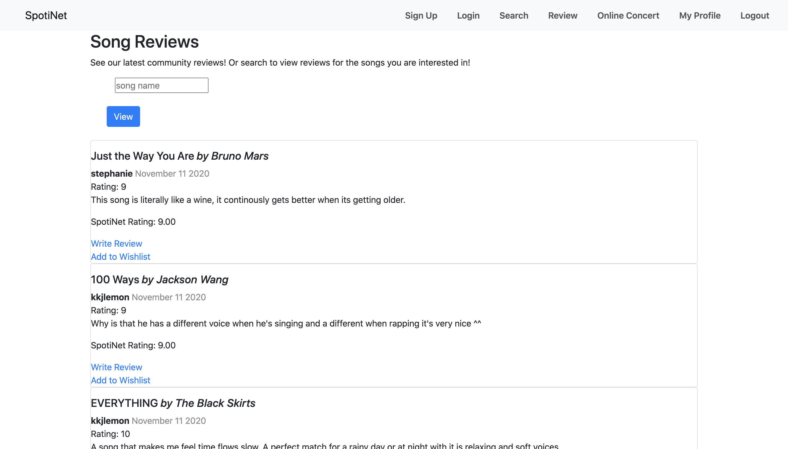
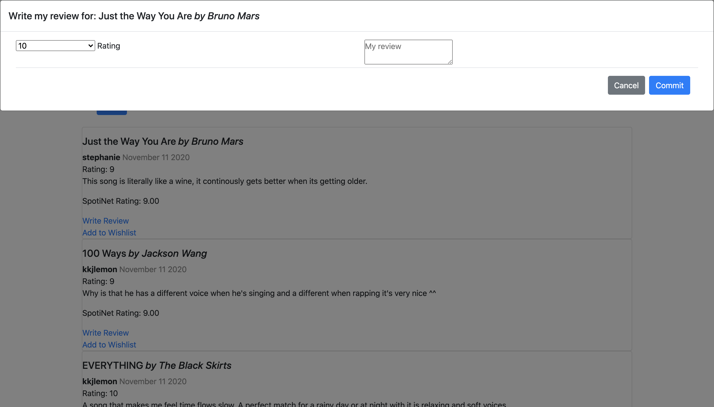
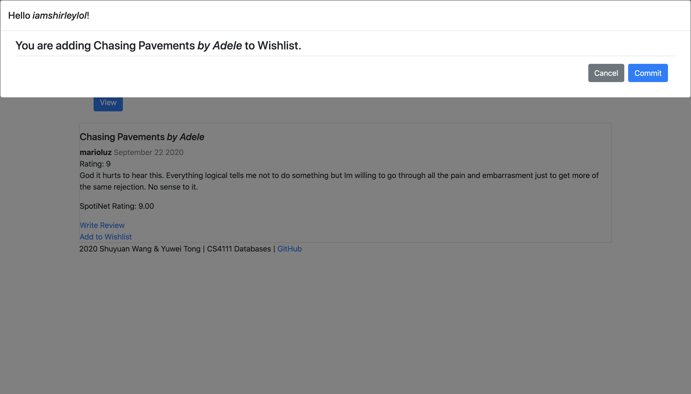
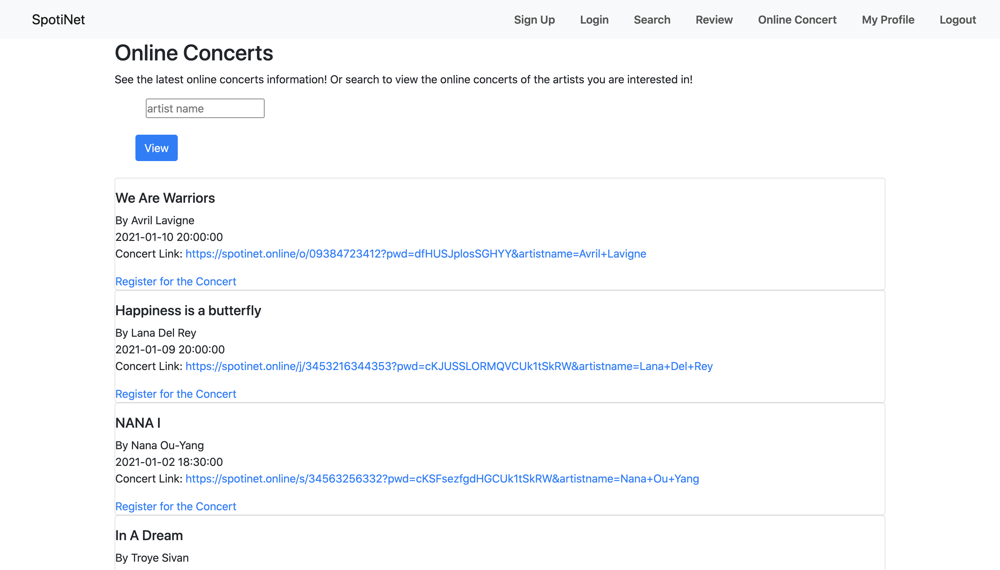
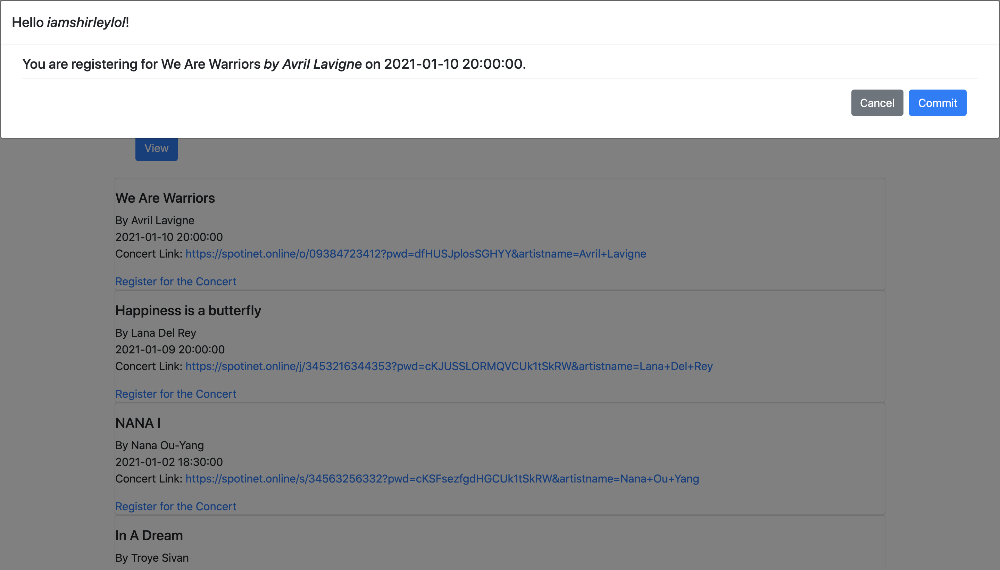
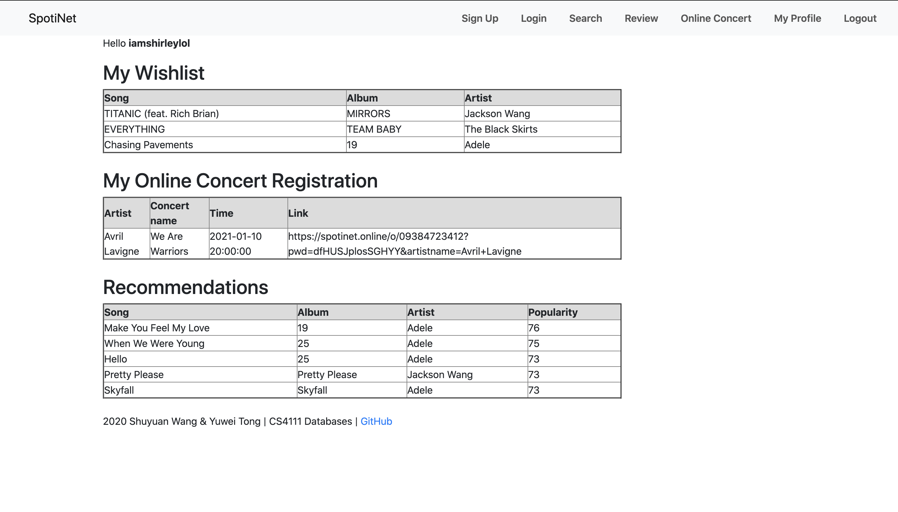

## Team members

Shuyuan Wang, sw3449

Yuwei Tong, yt2713

+ PostgreSQL account： sw3449 & Password: 6294

+ URL for our web app: http://34.73.205.96:8111/

## The parts we implemented
**Sign up/login**

+ Users need to login (if not registered, sign up first) before exploring our web app
+ If sign up with existing username, users would be notified
+ If enter wrong username or password, users would be notified

**Search**
+ Users can fuzzy search by artist name/album name/song name to query all related information
+ If no active search, 5 top-trending songs would be shown by default

**Review**
+ Users can fuzzy search by song name to query all related reviews and ratings by SpotiNet users
+ If no active search, top 5 latest reviews and ratings on songs would be shown by default
+ Users can review and rate certain songs by clicking on the link “Write Review”
+ Users can add songs to wishlist by clicking on the link “Add to Wishlist”

**Online Concert**
+ Users can fuzzy search by artist name to query all related online concerts information
+ If no active search, all future concerts would be shown by default
Users can register for the online concert by clicking on the link “Register for the Concert”

**My Profile**
+ Users can view their wishlist
+ Users can view their concert registration order by concert time
+ Users can view song recommendations based on their wishlist preferences

## The parts we did not implement
NA

## Two web pages that require the most interesting database operations
**Review page**

In this page, users can search for the song they’d like to review or add to wishlist by song name. Since fuzzy search is available on this page, it’s okay if users cannot remember the full name of the song. With the input of key words, our database will query and  return all the related songs using the ‘ILIKE’ operator. So users can choose the one they want  from the result list. We think that’s interesting because this function is quite user-friendly and user experience won’t be affected even if they cannot remember the exact song name. For every song, users can get information like song name, artist name, average rating given by users of our application, and detail about the most recent review and rating,  including username and review date. And for every song, users have two operations--”Write Review” and “Add to Wishlist”. When they click the ”Write Review” button, a window will appear on the top of the page, which helps them double check the song name and artist name, and let them choose a rating from 1 to 10 and write a detailed review. Similarly, when they click the “Add to Wishlist” button, a window will appear to help them double check the song they’re adding. Then by clicking the “Commit” button on the pop-up windows, a new record of data will be automatically inserted into our review/wishlist dataset. We find this part interesting because the operations are very easy and convenient for users. With clear instructions and buttons, users can add a review and update wishlist quickly. 

**My profile page**

This page shows a summary of current user’s activities on our web app, including what songs they add to their wishlists, what online concerts they register for. It shows time and links for online concerts, and the registered online concerts are designed to order by concert time so that it’s more convenient for users to look at the schedule and enjoy the concerts by simply clicking the links. More importantly, we think this page is most interesting because we have a recommendation section at the bottom of the page. The recommendations are made based on the user’s wishlist. For the wishlist and online concert summaries, we wrote SQL queries concerning multiple joins and order by clause. For the recommendations, we first find the artists who share the same genre(s) as the artists whose songs are added to wishlist by our users by using multiple subqueries and IN operator and UNNEST function because we store genres for each artist as arrays in database (one artist may have several genres). Finally we recommend the most popular songs by those filtered artists, excluding the songs that have already been in the user's wishlist using NOT IN operator.

## Screenshots for our web

Homepage:

Signup:

Login:

Search page:

See other users' reviews:

Review and rate the songs:

Add the song to wishlist:

View all available online concerts:

Register for online concert:

User profile:

